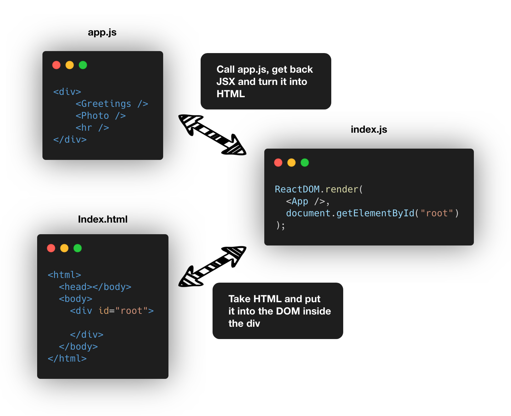

# Section 1: Let's Dive In!

Example App Link: [Click here!](https://codesandbox.io/s/react-jg4cq)

## What is that App function?

- App component: Produces JSX and handles user events that returns JSX
- JSX: Set of instructions to tell React what content we want to show on the screen (JSX is not HTML!)
  - JSX Elements helps us:
    - Tell React to create a normal HTML element
    - Tell React to show another component
- Check if it is a DOM element -> If not, call the component function and inspect all the JSX we get back -> If yes, show it on the screen

## How did some content get displayed on the screen?
- Browser requests HTML file
- HTML file is served
- HTML file calls index.js
- Index.js is served
- App component inside index.js is called
- Gets back JSX, and turns it into HTML
- Take that HTML and put it back into the DOM inside the HTML file



## What's the difference between React and ReactDOM?
- React: Knows how to work with components, called a **'reconciler'**
- ReactDOM: Knows how to take instructions on what we want to show and turn it into HTML , called a **'renderer'**

## What is useState?
- Function for working with React's 'state' system
- State is used to keep track of data that changes over time
- Used to make React update the HTML on the screen

# Installing create-react-app
```bash
npm install -g create-react-app
```
or
```bash
npx create-react-app <react-app-name>
```
- npm: Node Package Manager
- npm is used to install Javascript packages to power projects
- npx: npm package runner
- npm vs npx: 
  - NPM - Manages packages but doesn't make life easy executing any.
  - NPX - A tool for executing Node packages.

# Why use create-react-app?
- We want to use newer Javascript version, but modern browsers may not support them.
- Using Babel, Babel can spit out our code into compatible ES5 Javascript code.
- create-react-app contains
  - Babel
  - Webpack
  - Dev Server
  - And so on...

# Project Directory
- src: Folder where we put all the source code we write
- public: Folder that stores static files, like images
- node_modules: Folder that contains all of our project dependencies
- package.json: Records our project dependencies and configure our project
- package-lock.json: Records the exact version of packages that we install
- README.md: Instructions on how to use this project

# Starting and stopping the Application
```bash
npm start
```
or
```bash
yarn start
```

to stop the server, press `ctrl + c`

### Common errors

- Port in use
  - press yes
- localhost:3000 not working
  - go back to terminal and find `on your network` and use the link

# Starting with React
There are three steps when using react

1. Import the React and ReactDOM libraries
2. Create a react component
3. Take the react component and show it on the screen


# Javascript Modules Systems
All code that is written in a file is not accessible to other files by default, it is in their own universe. (Called Modules)

When importing modules:
```javascript
import React from 'react'
```
- `import`: We want to get code from some other file or dependency
- `React`: The variable we want to assign this import to
- `from`: We are about to specify the name of the library or file we are importing from
- `'react'`: the name of the dependency or path to the file we are importing

We are using the ES2015 import statement.

# What is a component? 
- A React component is a **function** or a **class** that produces HTML to show the user and handles feedback from the user

Creating functional components
```javascript
const App = function() {
  return <div> Hi There! </div>
}

//or

const App = () => {
  return <div> Hi There! </div>
}

// Showing the component on the screen

React.DOM.render(
  (<App />).document.querySelector("#root")
);

```

